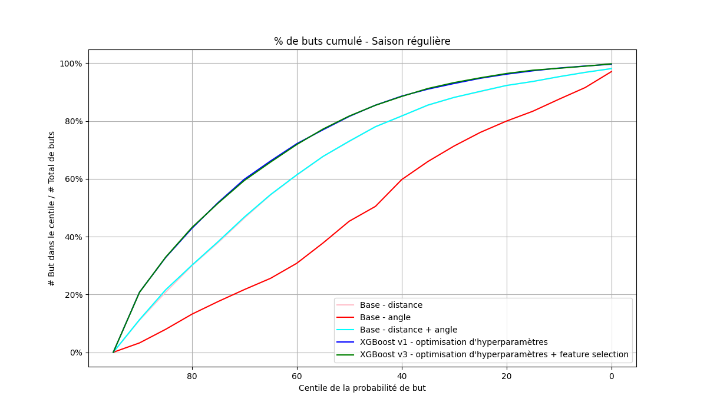
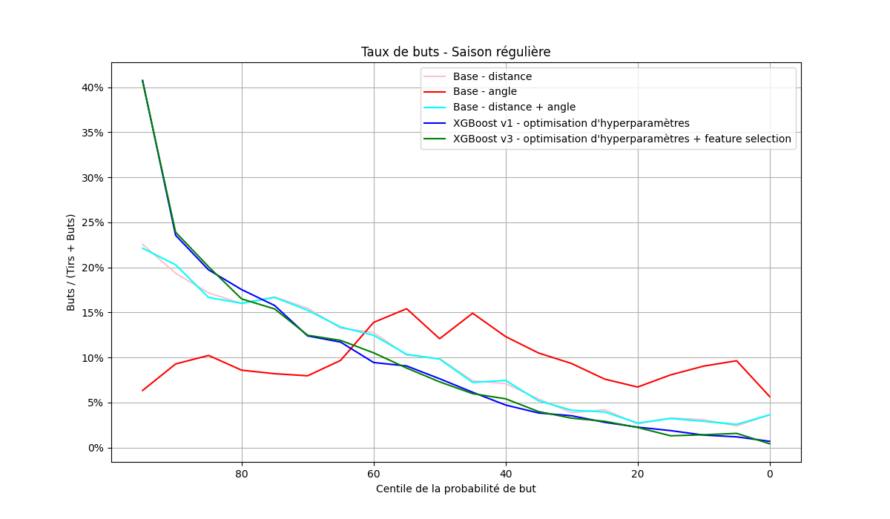
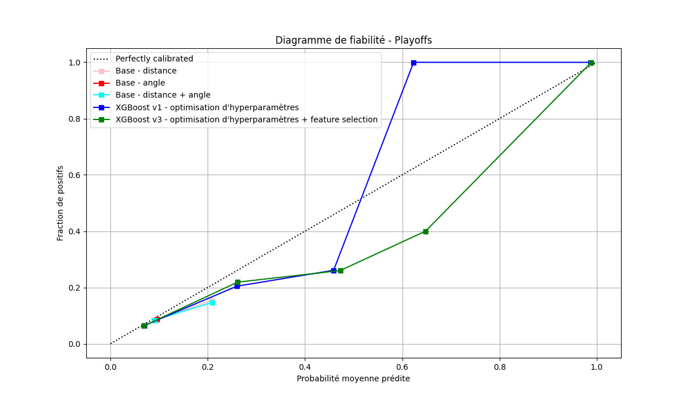

# NHL Goal Prediction

This project is a machine learning application designed to predict the probability of a shot scoring a goal in NHL games. This app processes detailed game data and generates probabilistic predictions, providing insights into shot success rates.

---

## Overview

* **Interactive Debugging Tool:** Allows users to visualize events on the rink given a game ID.
* **Dataset Creation:** Pulls data using REST API requests from the official NHL API and creates a comprehensive dataset.
* **Data Analysis:** Creates shot heatmaps for teams in a given year, showing their prefered shooting coordinates.
* **Probability-Based Predictions and Model Performance Analysis**: Logistic regression, XGBoost, and MLP models are utilized to output the likelihood of a shot being a goal.
* **Model Performance Analysis:** Many different analysis are employed to compare the performance of all models.
* **Interactive Application**: Allows users to input game data and receive predictions in a dockerized application.

---

## Interactive Debugging Tool

The interactive debugging tool allows users to visualize events as they occur on the rink. This can be helpful in feature engineering new datasets.

---

## Dataset Creation

An extensive dataset was created, filtering all shots made in regular and playoff seasons between 2016 and 2024 (see ift6758/data/mileston2_data_retriever.py and ift6758/data/data_cleaner_milestone2.py).

| Feature                  | Description                                                                          |
| ------------------------ | ------------------------------------------------------------------------------------ |
| game_id                  | Unique game ID.                                                                      |
| play_id                  | Unique play ID in the current game.                                                  |
| period                   | Period during which the play has occured.                                            |
| is_goal                  | Binary value indicating if a goal was scored.                                        |
| x_coord                  | X coordinate on the rink, normalized to one side, in feet.                           |
| y_coord                  | Y coordinate on the rink, normalized to one side, in feet.                           |
| shot_type                | Type of shot (slap, snap, tip-in, wrist, etc.).                                     |
| is_empty_net             | Binary value indicating if the goalie was in the net at the time of the shot.        |
| distance                 | Distance in feet between the player and the net at the time of the shot.             |
| angle_to_goal            | Angle in degrees between the player and the net at the time of the shot.             |
| game_seconds             | Elapsed time in seconds since the start of the game.                                 |
| last_event_type          | Type of the previous of event (event ID).                                            |
| last_event_x_coord       | X coordinates in feet of the previous play.                                          |
| last_event_y_coord       | Y coordinates in feet of the previous play.                                          |
| time_since_last_event    | Elapsed time in seconds since the last event.                                        |
| distance_from_last_event | Distance in feet covered since last play.                                            |
| rebound                  | Boolean value indicating whether the previous play was a shot.                       |
| angle_change             | Change of angle in degrees between last play and current shot.                       |
| speed                    | Speed in feet per second (distance covered since last play divided by elapsed time). |
| time_since_powerplay     | Elapsed time in seconds since the start of a powerplay (0 if no powerplay).)         |
| away_skaters             | Number of opposing players on the ice.                                               |
| home_skaters             | Number of home team players on the ice.                                              |

The dataset contains approximately 276,000 non-goal shots and 29,000 goals.

---

## Data Analysis

From the dataset, shot maps were created by binning all shots by team, year, and coordinates into an array the size of the rink. Gaussian smoothing was then applied to interpolate continous values between grid lines, thus creating a heatmap. The heatmaps were generated for all teams between 2016 and 2020.

---

## Model Performance Analysis - Regular Season

In this section, the MLP will be omitted because its ROC-AUC was significantly inferior to XGBoost models and thus not of interest. For reference, please see ift6758/data/models/experiments.ipynb.

All models have been trained on all regular-season shots from 2016 to 2019 inclusively.

To test the models, we have made predictions about the 2020 regular season and produced several graphs. We tested the following models:

- A basic model (logistic regression) trained only on distance
- A basic model trained only on angle
- A basic model trained on angle and distance
- An XGBoost model trained on all data with hyperparameter optimization
- An XGBoost model trained on all data with feature engineering and hyperparameter optimization.

Hyperparameters will be labeled on the graphs to aid readability.

The graphs we will analyze will be ROC, cumulative goal percentage, goal rate and reliability graphs.

### ROC

Looking at the graph above, we can see that the curves are generally quite distinct from one another, apart from the two Base - distance and Base - distance + angle curves, and the two XGBoost curves, which are essentially identical.

#### Angle-driven model

The Base - angle line shows a similar shape to the random line, with added noise. What's more, the area under the curve has a value of 0.512, which is identical to the area of a perfectly random curve of 0.5. We can therefore conclude that the angle probably has very little impact on the probability of scoring.

#### Distance-trained models

Moving up the curves, we find the Base - distance and Base - distance + angle curves. We have observed that angle seems to play no role in the probability of a shot hitting the target. This is also justified by the fact that the distance + angle curve has no difference from the distance curve. So, we see that with ROC AUC scores of 0.697, distance plays a significant role in predicting the probability of scoring a shot. That distance in a logistic regressor gives a respectable result, but again we can do a little better.

#### XGBoost

Re-potting once again, we see the XGBoost curves. These curves are as identical as the last ones - they also have an identical AUC ROC score when rounded to 3 significant figures, i.e. 0.778, a pretty respectable score.

From this curve, we can see quite clearly that the XGBoost models demonstrate the best compromise between the rate of true positives and the rate of false negatives. By manipulating the classification threshold of the latter, we'll generally end up with the best compromise between the rate of well-classified goals and the rate of misclassified goals.

### Percentage of cumulative goals predicted

The graph above is remarkably similar to the last one. Once again, we see that the Base - angle model forms almost a straight line, that the base models including distance are identical and that the XGBoost models are also identical.

#### Angle-driven model

Returning to the angle line - we see similar behavior to the last graph. As we move down the percentiles, the percentage of cumulative goals rises linearly. This again supports our hypothesis that angle has no impact on goal probability and so the probability percentiles with this model essentially randomly predict whether it will be a goal or not, which explains the right-hand line.

#### Distance-trained models

Again, we see that models including distance perform relatively well, especially in comparison with angle. They predict a lot of goals in the higher percentiles, meaning that predictions with a higher probability actually predict more goals. As we move down the percentiles, we can visually determine that the derivative of the graph is moving down, indicating that with lower probabilities, fewer goals are accumulating. This is the expected result of a good model.

#### XGBoost models

However, XGBoost models perform even better. Looking at the graphs, we see that the value of the graph derivative is highest in the high percentiles for the XGBoost models. This indicates that they quickly accumulate goals in the high percentiles when the predicted goal probability is high.

In the end, we can still see that the XGBoost models perform best and come closest to the ideal graph, i.e. a vertical line at zero on the x-axis rising to 100% and a horizontal line at 100% on the y-axis (a bracket).

### Goal rate

In this graph, we can distinguish the different lines a little better, but we still observe the same trend - the angle line looks random, the distance-trained model lines perform relatively well and are very close, and the XGBoost models perform best and are also very close.

#### Angle-driven model

We can see that the Base - angle model curve is a little noisy, but in general, if we were to draw a trend line through it, we'd see that whatever the percentile, the goal rate remains relatively constant at around 10%. This is indicative of a model that makes predictions that are not correlated with true goal probability.

#### Distance-trained models

Distance-trained models again show very similar curves. They show a relatively high goal rate that is predicted in the high percentiles and drops apiciously at the beginning, but quietly towards the end. This is indicative of models that make probability predictions that are truly correlated with true probability.

#### XGBoost models

XGBoost models have the best curves of all models. They have the most apical slope in the high percentiles indicating that they predict goals well when their predicted probability is high.

### Reliability diagram

#### Angle-trained model

We can see that this model doesn't make predictions exceeding around 7% probability. This is not surprising given the latest analyses.

#### Models trained on distance

We see that these models don't make high probability predictions either - no more than 20%. This explains why none of the shots is predicted as a goal - none of the percentages exceeds the 50% threshold.

#### XGBoost models

In general, we can see that the XGBoost models make fairly reliable predictions on this data set. Their curves closely match the ideal curve. We do, however, see a touch of under-confidence between around 50% and 65% of average predicted probability, followed by a compensating slight over-confidence towards the end of the curves. This trend is slightly more pronounced in the model without feature engineering.

## Model Performance Analysis - Playoffs

Now we'll look at the models' performance on 2020 playoff shots. The aim of this section will be less to compare model performance, but rather to compare performance on this specific dataset.

The playoffs are considered a more intense game environment - the stakes are higher. As a result, players' behavior is likely to differ from their behavior in the regular season. In other words, there's a risk that playoff shots will be part of a different distribution than regular-season shots.

We'll see how our models perform on these new data.

### ROC

We can see that the general trend is the same as in the regular season. However, performance has dropped slightly - by around 0.18 for the XGBoost models and also for the distance-trained models. The angle-trained model remains exactly as random as before. This drop in performance suggests overfitting on regular-season data. It remains to be said that the performance of the model with feature engineering has not dropped as much - suggesting that feature engineering has enabled better generalization of predictions on this dataset.

### Percentage of cumulative goals predicted

Compared with the regular season graph, there is no significant difference. The only difference is that the XGBoost model with feature engineering seems to perform slightly better than without feature engineering.

### Goal rate

Again, the general trend is the same as with the regular season, but with poorer performance. We see in the other graph that goal rates started above 40% for the XGBoost models, which is reduced to below 35% in this case. This indicates that fewer goals are predicted correctly in the higher percentages of predicted probability for the playoff season than the regular season.

### Reliability diagram

Here we really see a big difference between the playoff graph and the regular season graph. In this case, we see that all the models are less reliable, and we also see a divergence in the reliability of the XGBoost models. Among other things, the XGBoost model without feature engineering is very over-confident of predictions between around 40% and 60% of average predicted probability and compensates by being completely under-confident afterwards because all the positives have already been predicted. In contrast, the XGBoost model with feature engineering seems to benefit from better reliability - it is under-confident when the average predicted probability is low, but regains confidence in its predictions thereafter.

## Model Performance Analysis - Conclusion

In summary, we see that the XGBoost models perform significantly better in all the metrics analyzed than the basic models, both in the regular season and in the playoffs, but particularly better in the playoffs for the model with feature engineering.

Based on previous analyses, we observed that:

- angle does not seem to have any impact on the probability of a shot being a goal
- XGBoost models are better at differentiating goals from unsuccessful shots, with an AUC performance of 0.778 over the regular season.
- Models perform less well in the playoffs
- Models overfitted on regular season data
- Feature engineering helped mitigate this overfitting

In conclusion, XGBoost with feature engineering and hyperparameter optimization is the most robust prediction model in this context. However, the differences in performance between the regular season and the playoffs demonstrate the need for better adjustment of the models to account for variations in shot distribution. This opens up avenues for future improvements, such as incorporating playoff data into training.

---

## License

This project is licensed under the MIT License.

---

## Acknowledgments

* NHL for providing publicly available game data.
* XGBoost and Python libraries for their robust machine learning frameworks.
* Contributors and open-source community for inspiration and guidance.

---

## Contact

For questions, suggestions, or contributions, please contact daniel.lofeodo@gmail.com, nathan.cormerais@umontreal.ca

---

## Dataset Overview

The
---
